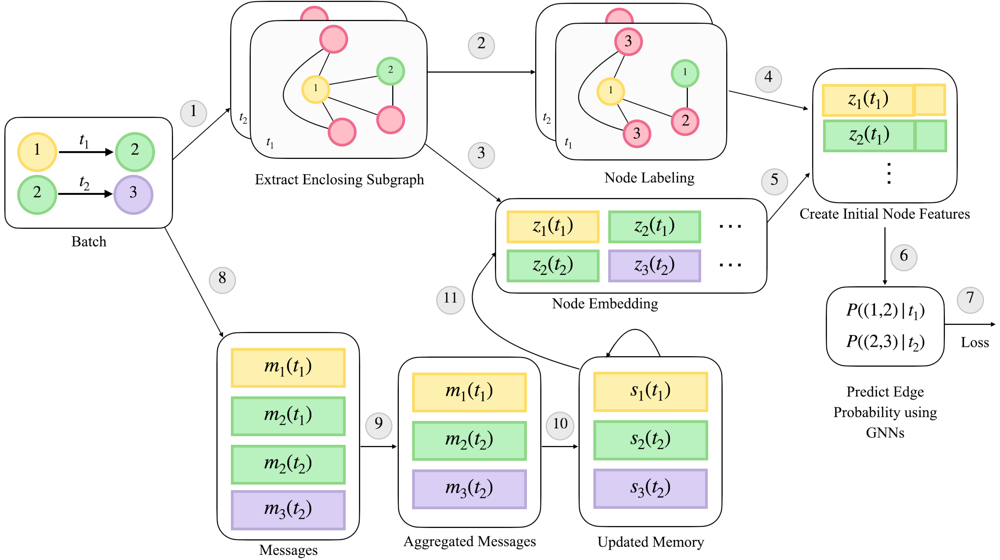

# A Hybrid TGN-SEAL Model for Dynamic Graph Link Prediction

## Introduction

This repository contains the implementation of TGN-SEAL, a novel framework for link prediction in sparse, evolving networks. Link prediction in dynamic networks—especially those with sparse connectivity and continuously changing structures—is a challenging problem with important applications in areas such as telecommunication, social networks, and recommendation systems.

TGN-SEAL builds upon Temporal Graph Networks (TGNs) by incorporating local structural information through enclosing subgraphs around candidate links. By jointly leveraging temporal patterns and topological context, our method improves predictive accuracy over standard TGNs, particularly under sparse conditions.



## Running the experiments

### Requirements

Dependencies are included in requirements.txt

```bash
pip install -r requirements.txt
```


### Dataset and Preprocessing

### Download the Public Data

1. Download the CDR datasets (e.g., the Reality Mining CDR dataset) from [here](http://realitycommons.media.mit.edu/realitymining.html).

2. Convert the `.mat` files into CSV format using the provided script:

```bash
python utils/extract_calls.py
```

#### Preprocess the data
We use the dense `npy` format to save the features in binary format. If edge features or nodes 
features are absent, they will be replaced by a vector of zeros. 
```{bash}
python utils/preprocess_data.py --data calls
```

### Model Training

Self-supervised learning using the link prediction task:
```{bash}
python train_self_supervised.py -d calls --use_memory --prefix tgn-seal --embedding_module time --n_runs 10 --n_epoch 40 
```

### Plot Results
After training, plot the results by running:
```{bash}
python plot_result 
```
